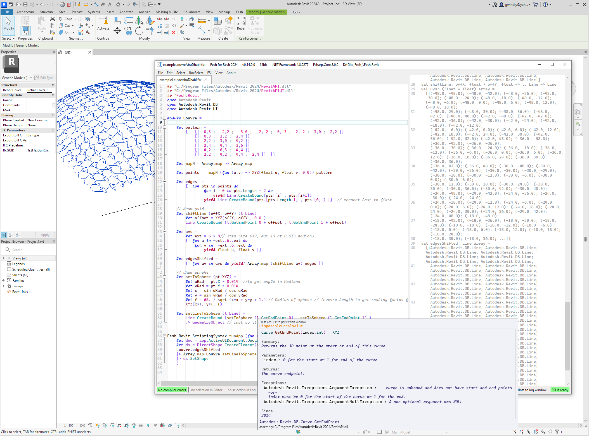

# THIS DOES NOT WORK YET IT IS JUST COPIED AND RENAMED FROM Fesh.Revit

# Fesh.AutoCAD
[](https://github.com/goswinr/Fesh.AutoCAD/actions/workflows/build.yml)
[](https://hits.seeyoufarm.com)

[](LICENSE)

Fesh.AutoCAD is an F# scripting editor hosted inside [AutoCAD]("https://www.autodesk.com/products/autoCad/overview"). It is based on [Fesh](https://github.com/goswinr/Fesh).\
It has semantic syntax highlighting, auto completion, type info tooltips and more.\
The output window supports colored text.


The example script in the root folder generates the axes for cladding of the Louvre Abu Dhabi.\
See also my talk at <a href="https://www.youtube.com/watch?v=ZY-bvZZZZnE" target="_blank">FSharpConf 2016</a>


## How to install


Download and run the Setup.exe from [Releases](https://github.com/goswinr/Fesh.AutoCAD/releases).\
Use the .NET 8 version if you have AutoCAD 2025 or later.\
Use the .NET 4.8 version if you have AutoCAD 2024 or earlier.

Fesh.AutoCAD will automatically offer to update itself when a new version is available.

The installer is created with [Velopack](https://velopack.io) and digitally signed.

No admin rights are required to install or run the app.\
The app will be installed in `\AppData\Local\Fesh.AutoCAD`. \
Setup will launch the `Fesh.AutoCAD.Bootstrapper.exe`. It will register the `Fesh.AutoCAD.dll` with AutoCAD \
by creating an `Fesh.AutoCAD.addin` xml file in the AutoCAD Addins folder at `C:/ProgramData/Autodesk/AutoCAD/Addins/20XX/Fesh.AutoCAD.addin`.


### How to use F# with AutoCAD
By default a f# script evaluation starts asynchronous on a new thread. The `Fesh.AutoCAD.dll` also provides utility functions to run <a href="https://knowledge.autodesk.com/support/autoCad-products/learn-explore/caas/CloudHelp/cloudhelp/2014/ENU/AutoCAD/files/GUID-C946A4BA-2E70-4467-91A0-1B6BA69DBFBE-htm.html" target="_blank">synchronous transaction</a> on the current document or app instance:

```fsharp
Fesh.AutoCAD.ScriptingSyntax.runApp (fun (app:UIApplication)  -> ...)
```

## Release Notes
For changes in each release see the  [CHANGELOG.md](https://github.com/goswinr/Fesh.AutoCAD/blob/main/CHANGELOG.md)

## License
Fesh is licensed under the [MIT License](https://github.com/goswinr/Fesh.AutoCAD/blob/main/LICENSE.md).
